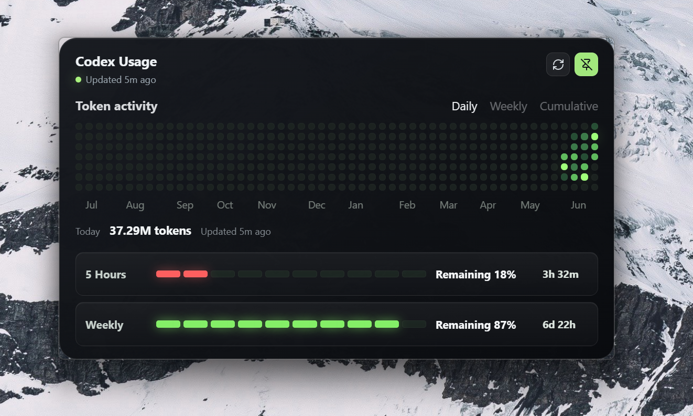

# Codex Usage Widget

Windows floating widget for Codex local usage limits and token activity.



The widget reads local Codex session logs from `%USERPROFILE%\.codex\sessions`.
It does not call the OpenAI API, scrape the Usage Dashboard, read other AI tools,
upload telemetry, or copy Codex prompts/session payloads into diagnostics.

## Download

Download the latest Windows x64 Beta from
[GitHub Releases](https://github.com/hexfeng/CodexUsageDashboard/releases/latest).

Use the NSIS setup executable named like `Codex_Usage_0.2.0_x64-setup.exe`.
Windows 10 and Windows 11 on x64 are supported. ARM64, x86, macOS, Linux, MSI,
Microsoft Store, and signed Authenticode installers are outside this Beta.

## Install

1. Download the NSIS setup executable from GitHub Releases.
2. Run the installer.
3. If Windows SmartScreen warns, choose `More info` and `Run anyway` only if the
   file came from the official release page.
4. Launch `Codex Usage`.

The Beta installer is unsigned, so SmartScreen warnings are expected.

## Features

- 12-month token heatmap from local `token_count` events.
- 5h and weekly usage bars from local `rate_limits` snapshots.
- Today token total, session count, freshness status, manual refresh, and
  always-on-top toggle.
- Automatic local refresh every 60 seconds.
- Tauri tray menu: Show, Hide, Refresh, Diagnostics, Exit.
- Close-to-tray behavior; use `Exit` to terminate the process.
- Single-instance behavior; duplicate launches focus the existing widget.
- Optional `Launch at startup` setting in Diagnostics.
- Window position and size persistence.
- Signed in-app update checks after launch; updates install only after user
  confirmation.
- Safe diagnostic summary for GitHub issues.

## Data Model

The Rust backend persists a small SQLite database under the local app data
folder.

- `usage_daily`: daily token aggregates from `payload.info.last_token_usage`.
- `limit_snapshots`: raw 5h/weekly rate limit snapshots.
- `processed_events`: event hashes used to prevent double-counting.
- `app_config`: sessions path and widget settings.

Uninstalling removes the application but leaves the local database, settings,
and logs under the platform app data directories. Delete those folders manually
if you want a full reset before reinstalling.

## Diagnostics

Open the tray menu and choose `Diagnostics`.

The diagnostics panel shows app version, platform, sessions path readability,
database path, log directory, latest scan result, scan counters, and the latest
non-sensitive error. `Copy` copies only that displayed metadata. It does not
attach logs or session files.

## Troubleshooting

- `Usage limit unavailable`: no non-null `rate_limits` snapshot was found in
  local Codex logs yet.
- Missing sessions path: confirm `%USERPROFILE%\.codex\sessions` exists or set
  a custom path.
- Malformed or unreadable logs: the scanner records counts and keeps the last
  valid dashboard state when possible.
- Update check errors: local usage monitoring continues; try the GitHub Release
  page manually.

## Development

Requirements:

- Node.js 20+.
- npm 10+.
- Rust/Cargo and the Tauri v2 system prerequisites for Windows.

Commands:

```powershell
npm ci
npm test
npm run build
npm run tauri dev
```

Rust checks:

```powershell
cd src-tauri
cargo fmt -- --check
cargo test
cargo check
```

Release build:

```powershell
$env:TAURI_SIGNING_PRIVATE_KEY=Get-Content -Raw "$env:TEMP\codex-usage-widget-v02-updater.key"
$env:TAURI_SIGNING_PRIVATE_KEY_PASSWORD="<updater-key-password>"
npm run tauri build
```

Production releases are triggered by tags such as `v0.2.0`. The tag version must
match `package.json`, `src-tauri/Cargo.toml`, and `src-tauri/tauri.conf.json`.
GitHub Actions needs these secrets for updater artifacts:

- `TAURI_SIGNING_PRIVATE_KEY`
- `TAURI_SIGNING_PRIVATE_KEY_PASSWORD`
